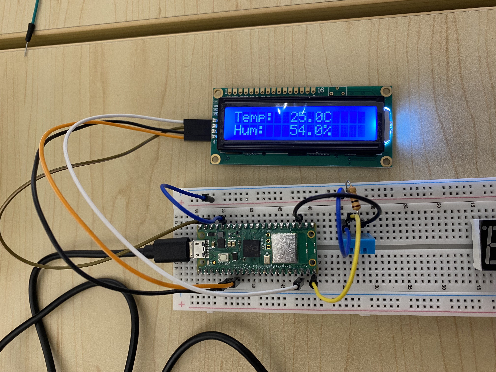
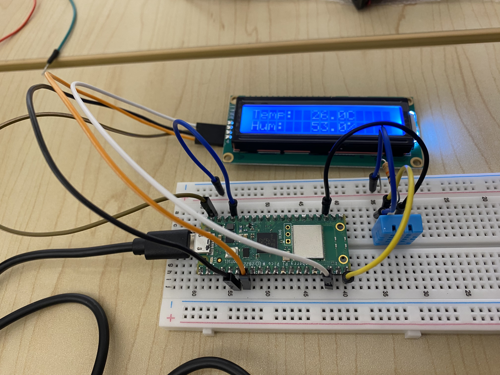
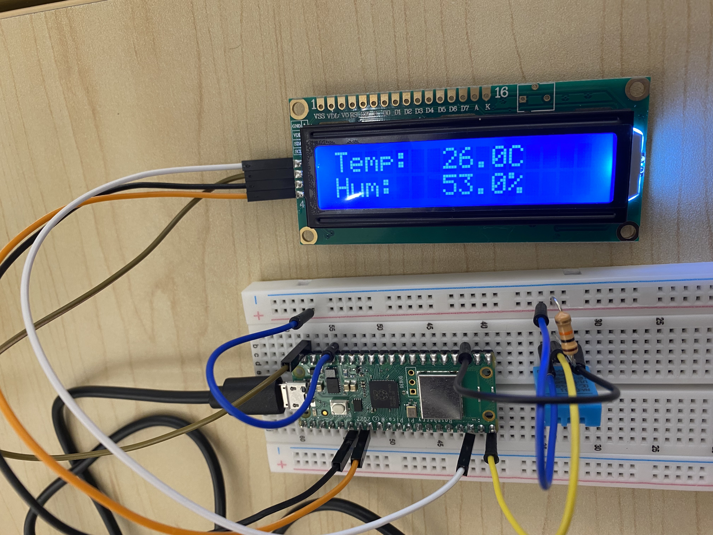

# Thermohygrometer for Raspberry Pi Pico

This project is a thermohygrometer application for the Raspberry Pi Pico (RP2040) or Raspberry Pi Pico 2 (RP2350), designed to read temperature and humidity from a DHT sensor (DHT11 or DHT22/AM2302) and display the readings on an I2C LCD 1602 display.

## Overview

The program initializes a DHT sensor and an I2C LCD. It periodically reads temperature and humidity data from the DHT sensor. The collected data is then formatted and displayed on the LCD screen. Serial output is also provided for debugging purposes, showing the sensor readings and status messages. This allows users to monitor environmental conditions easily.

## Features

- Supports Raspberry Pi Pico (RP2040) and Raspberry Pi Pico 2 (RP2350).
- Reads temperature and humidity from DHT11 or DHT22/AM2302 sensors.
- Displays readings on an I2C LCD 1602 display.
- Periodic updates of readings on the display.
- Serial output for debugging and monitoring.

## Hardware Requirements

- Raspberry Pi Pico or Pico 2 board.
- DHT11 or DHT22/AM2302 temperature and humidity sensor.
- I2C LCD 1602 display.(https://store.freenove.com/products/fnk0079)
- Jumper wires for connections.

## Software Requirements

- Raspberry Pi Pico SDK.
- CMake and a suitable C++ compiler.
- USB serial terminal program (for optional serial monitoring).

## Building the Project

1.  Ensure the Pico SDK is installed and the `PICO_SDK_PATH` environment variable is set.
    - For example, if you cloned the SDK to `~/pico-sdk`, set the variable:
        ```bash
        export PICO_SDK_PATH=~/pico-sdk
        ```
    - If you are using a different path, adjust accordingly.
2.  Clone this repository or download the source code.
    ```bash
    git clone https://github.com/alexnet819/Thermohygrometer.git
    cd Thermohygrometer/src
    ```
3.  Create a build directory inside the project folder:
    ```bash
    mkdir build
    cd build
    ```
4.  Run CMake to configure the project and generate the Makefiles:
    ```bash
    cmake ..
    ```
5.  Build the project using the generated Makefiles:
    ```bash
    cmake --build .
    ```
6.  The firmware file `thermohygrometer.uf2` will be generated in the `build` directory.

## Building and Running with Docker/nerdctl

This project includes a `Dockerfile` to build the firmware in a containerized environment. This ensures a consistent build environment.

### Prerequisites

- Docker or nerdctl/buildkit installed.

### Building the Docker Image

Navigate to the root directory of this project (where the `Dockerfile` is located) and run:

**For Docker:**
```bash
docker build -t thermohygrometer-builder .
```

**For nerdctl:**
```bash
nerdctl build -t thermohygrometer-builder .
```
This will create a Docker image named `thermohygrometer-builder` containing the Pico SDK and all necessary build tools.

### Building the Firmware using the Docker Image

Once the image is built, you can compile the thermohygrometer firmware. The build script inside the container expects the project source code to be mounted at `/thermohygrometer`. The `src` subdirectory (containing the main `CMakeLists.txt`) will be used by default.

**For Docker:**
From the root directory of this project:
```bash
docker run --rm -v "$(pwd):/thermohygrometer" thermohygrometer-builder build-pico-project.sh src
```

**For nerdctl:**
From the root directory of this project:
```bash
nerdctl run --rm -v "$(pwd):/thermohygrometer" thermohygrometer-builder build-pico-project.sh src
```

- `$(pwd)` mounts the current host directory (your project root) to `/thermohygrometer` inside the container.
- `build-pico-project.sh src` executes the build script, telling it that your project's main CMake source is in the `src` subdirectory relative to the mount point.
- The compiled `.uf2` file will be placed in the `output` directory within your project root on the host machine (e.g., `./output/thermohygrometer.uf2`).

### Cleaning Docker/nerdctl Build Cache (Optional)

If you need to clear the build cache to save disk space or resolve caching issues:

**For Docker:**
```bash
docker builder prune
```

**For nerdctl:**
```bash
nerdctl builder prune
```
This command removes all dangling build cache. Use with caution as it might slow down subsequent builds.

## Usage

1.  **Hardware Setup:**
    *   Connect the DHT sensor (DHT11 or DHT22/AM2302) to the Raspberry Pi Pico.
        *   VCC to a 3.3V pin on the Pico.
        *   GND to a GND pin on the Pico.
        *   DATA to the GPIO pin defined by `DHT_DATA_PIN` in `src/main.cpp` (default is GP15).
    *   Connect the I2C LCD 1602 to the Raspberry Pi Pico.
        *   VCC to a 3.3V or 5V pin (VSYS on Pico is suitable).
        *   GND to a GND pin on the Pico.
        *   SDA to the I2C SDA pin (default GP4 for `i2c0`).
        *   SCL to the I2C SCL pin (default GP5 for `i2c0`).
    *   Ensure all connections are secure.

2.  **Flashing the Firmware:**
    *   Connect the Raspberry Pi Pico to your computer via USB while holding down the BOOTSEL button.
    *   The Pico will appear as a mass storage device (like a USB drive).
    *   Drag and drop the `thermohygrometer.uf2` file (generated in the `build` directory during the build process) onto this drive.
    *   The Pico will automatically reboot and start running the program.

3.  **Operation:**
    *   Once the program starts, the LCD will display an initialization message ("LCD OK") followed by "Reading DHT...".
    *   After a short delay for sensor stabilization, the LCD will show the current temperature and humidity readings.
    *   Example display:
        ```
        Temp:   25.3C
        Hum:    45.8%
        ```
    *   The readings will update periodically (every 1.5 seconds for DHT11, 2.5 seconds for DHT22 by default).

4.  **Serial Monitoring (Optional):**
    *   Connect to the Pico's USB serial port using a terminal emulator program (e.g., PuTTY, minicom, tio).
    *   Common serial settings are 115200 baud rate, 8 data bits, no parity, 1 stop bit.
    *   You will see debug messages, initialization status, and sensor readings printed to the serial console. This is useful for troubleshooting.

## Configuration

- The default configuration should work for most setups. However, if you have specific requirements (e.g., different GPIO pins, I2C address), you can modify the following in `src/main.cpp`:
    - `DHT_DATA_PIN`: GPIO pin for DHT sensor data.
    - `PICO_DEFAULT_I2C_SDA_PIN` and `PICO_DEFAULT_I2C_SCL_PIN`: GPIO pins for I2C SDA and SCL.
    - `PICO_COMPILER`: Set to `pico_arm_cortex_m0plus_gcc` for RP2040, `pico_arm_cortex_m33_gcc` for RP2350.
    - `PICO_BOARD`: Set to `pico`, `pico_w`, `pico2`, or `pico2_w` based on your board.

## Troubleshooting

- If the LCD shows "Init Failed!" or similar errors:
    - Check the I2C connections (SDA, SCL, VCC, GND).
    - Ensure the correct I2C address is being used (0x27 or 0x3F for most LCDs).
    - Verify the LCD is powered and functional.

- If DHT readings fail:
    - Check the DHT sensor connections (DATA, VCC, GND).
    - Ensure the correct GPIO pin is defined for the DHT sensor.
    - Verify the DHT sensor is functional and not damaged.

- For serial monitoring issues:
    - Ensure the correct COM port is selected in the terminal program.
    - Check the USB cable and connection to the Pico.
    - Verify the serial settings (baud rate, data bits, parity, stop bit).

## Example Usage in Practice
<table>
  <tr>
    <td></td>
    <td></td>
    <td></td>
  </tr>
</table>